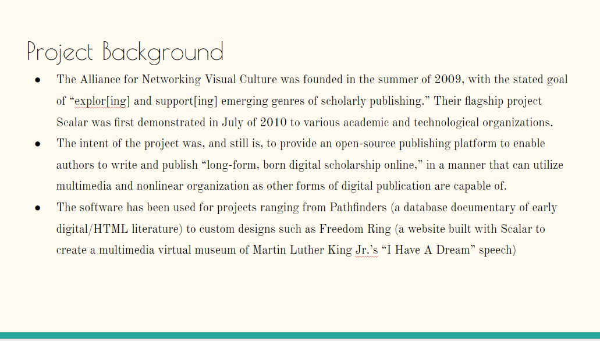

# Collaborative Project

#### Project Description
This project sought to work with a team to learn about a useful Digital Humanities tool. We chose to engage with a platform called Scalar created by the Alliance for Networking Visual Culture (ANVC). Scalar is an online scholarly publishing platform that allows users to upload files, text or other various forms of media. To test the tool, our team created our own page and published it with the program. It has very similar tools and functions to other digital publishing platforms, such as Wordpress. Our findings concluded that Scalar had no unique uses that set it apart from other such tools. It was simply built by, and for, content producers with a background in humanities.

#### Collaboration Statement
Collaboration can often be very valuable when conducting research. When approaching collaborative scholarship, it is essential to recognize that research often requires a diversified set of skills. In a collaborative environment, this means working alongside others and sharing skillsets. Not only that, but talent and experiences can be shared as well. Collaborating challenges each person to learn and cement what they are great at; being honest about their strengths and weaknesses. Using this Scalar project as an example, our group consisted of people with different strengths and preferences. Some of us are great public speakers, while others are not as strong. The others were more confident learning how to use the tool and build the test page and our presentation. By working together, we were able to properly study the use of the tool and report on it. Working with a team can often present challenges to the workflow of a project. These challenges might include problems maintaining communication channels or planning the stages of the work. An approach that I have found to work well for these small group projects are short scheduled meetings near the start of the assignment to break up the work and see that everyone has something to do. After that, maintaining communication becomes the focus. Using document-sharing platforms such as Google Docs is a fantastic way to manage the project and find out if any of the team members fall behind. Collaboration can be just as important to a research agenda as it is to any other activity. There are lists of reasons why associations are valuable resources for learning.

